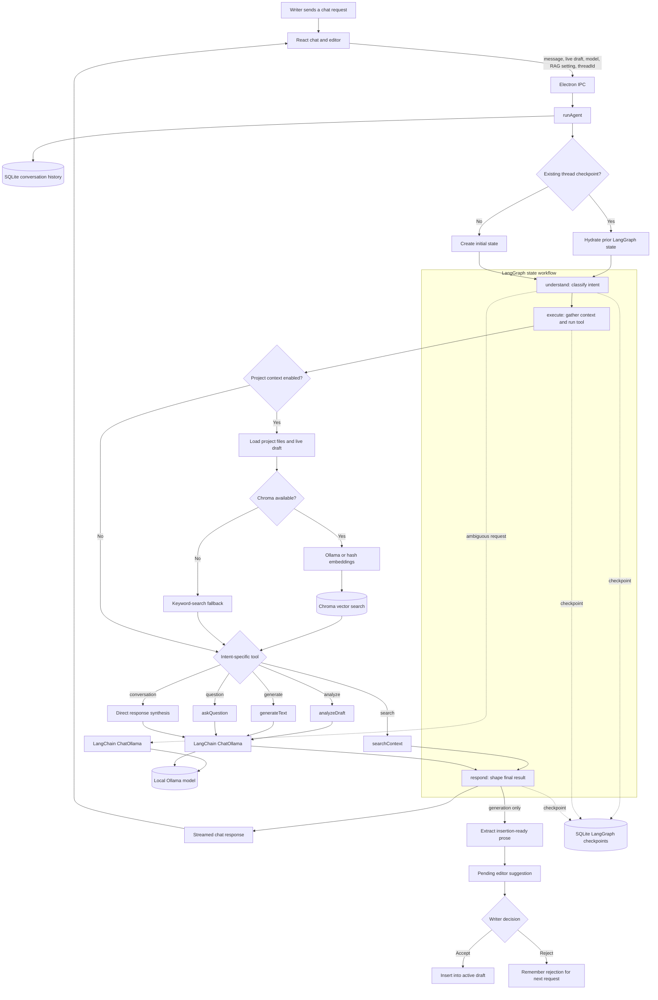

<h1 align="center">Drafts</h1>
<h2 align="center">Your Local AI Writing Companion</h2>

Drafts is a local-first desktop writing application with an AI companion for drafting, revising, searching project notes, and reviewing in-progress work.

<div align="center">

</div>

Built with Electron, React, TypeScript, Vite, LangChain, LangGraph, Ollama, ChromaDB, and SQLite.

## Features

- **Project-based writing workspace** - Open a local folder, create files, switch between tabs, and autosave changes.
- **Rich writing editor** - Distraction-focused editor with themes, font controls, spacing controls, and export support.
- **AI writing companion** - Ask for feedback, brainstorming, document recall, rewrites, or continuations from the chat panel.
- **Streaming chat** - Agent responses stream over Electron IPC and reveal progressively in the renderer.
- **Editor suggestions** - Generated prose is returned separately from chat commentary and appears as an accept/reject editor suggestion.
- **Revision loop** - Rejected suggestions are remembered and passed back to the agent so follow-up generations avoid repeating the same text.
- **Optional project context** - A RAG toggle retrieves relevant snippets from the current project before analysis, search, or generation.
- **Local Ollama models** - Uses `llama-writer`, a custom finetuned LLama3.0 model, by default, with `llama3.1` available from the model selector.
- **Session restore** - Last project, RAG preference, selected model, recent projects, and conversation state persist locally.
- **Document support** - Loads and saves `.md`, `.txt`, and `.docx`; `.doc` files are detected but not parsed as editable Word documents.

## Agent Workflow

The Electron main process exposes chat through IPC and runs a LangGraph state graph in `electron/ai`:



- `understand` classifies intent as search, analyze, generate, question, or conversational. Common requests use heuristic routing first, with Ollama available for ambiguous classification.
- `execute` runs the relevant tool: `searchContext`, `analyzeDraft`, `generateText`, or `askQuestion`. When RAG is enabled, retrieval runs before the intent-specific tool so project context can be reused.
- `respond` returns direct tool results where possible, streams final chat text when applicable, and keeps insertable generated prose separate from explanatory chat copy.
- `runAgent` saves user and agent messages in SQLite, hydrates prior graph checkpoints by `threadId`, and passes live editor content into tools so unsaved draft text is included.

## RAG Implementation

Project context is optional and controlled by the **Use project context** checkbox in chat.

When enabled:

1. Drafts loads supported project files from the selected folder.
2. The active editor's live plain text is added as a synthetic "current draft" document.
3. Documents are split into overlapping chunks of about 900 characters with 150 characters of overlap.
4. Chunks are indexed in a per-project Chroma collection named from a hash of the project path.
5. Query results are grouped by document and passed into search, analysis, generation, or final response prompts.

Retrieval has three modes:

| UI status | Behavior |
| --- | --- |
| `Vector (semantic)` | Chroma is available and embeddings come from Ollama, defaulting to `nomic-embed-text`. |
| `Vector (hash fallback)` | Chroma is available, but Ollama embeddings are unavailable, so Drafts uses deterministic local hash vectors. |
| `Keyword fallback` | Chroma is unavailable, so Drafts falls back to line-based keyword matching across project files. |

The Electron app auto-starts Chroma on launch by default. If Chroma is already running, Drafts reuses it. If Chroma cannot start, the app still works with keyword retrieval.

## Local Persistence

Drafts stores app state under Electron's user data directory:

- SQLite `app.db` stores recent projects, preferences, conversation messages, and LangGraph checkpoints.
- Chroma stores vector data under the app user data directory by default, or under `CHROMA_DATA_PATH` when configured.
- Preferences include the last project, RAG toggle state, and selected Ollama model.

Conversation continuity uses a generated `threadId`; each graph node saves a checkpoint so follow-up turns can merge prior messages and gathered state.

## Setup

Install dependencies:

```bash
npm install
```

Run the desktop app in development:

```bash
npm run electron:dev
```

Run the Vite renderer only:

```bash
npm run dev
```

Build the app:

```bash
npm run electron:build
```

## Ollama Setup

Drafts expects Ollama to be running locally for chat generation:

```bash
ollama list # verify that llama-writer is available
```

For semantic RAG, install the embedding model:

```bash
ollama pull nomic-embed-text
```

If the embedding model is missing, Drafts falls back to hash-vector retrieval while keeping Chroma enabled.

## Chroma Setup

The Electron main process starts Chroma automatically unless disabled:

```env
CHROMA_AUTO_START=false
```

To run Chroma manually:

```bash
npm run chroma
```

Useful `.env` options:

```env
CHROMA_HOST=localhost
CHROMA_PORT=8000
CHROMA_DATA_PATH=./chroma-data
CHROMA_AUTO_START=true
OLLAMA_BASE_URL=http://127.0.0.1:11434
OLLAMA_EMBED_MODEL=nomic-embed-text
```

## LangSmith Tracing

Agent tracing is instrumented with LangSmith and is off by default. To enable it, create a local `.env` file:

```env
LANGSMITH_TRACING=true
LANGSMITH_API_KEY=your_langsmith_api_key
LANGSMITH_PROJECT=drafts-desktop
```

Traces include the agent graph, intent understanding, tool execution, response synthesis, document search, draft analysis, and text generation spans.

## Scripts

```bash
npm run dev             # Start Vite
npm run electron:dev    # Start Vite and Electron
npm run build           # Build renderer
npm run electron:build  # Build packaged desktop app
npm run lint            # Run ESLint
npm run chroma          # Run Chroma manually with ./chroma-data
```

## Architecture Map

```text
src/
  App.tsx                    React app state, autosave, streaming chat, preferences
  components/AgentChat.tsx   Chat UI, model picker, RAG toggle, retrieval status
  components/DraftEditor.tsx Editor shell and suggestion controls

electron/
  main.js                    Electron lifecycle, document IPC, chat IPC, Chroma startup
  preload.js                 Safe renderer IPC bridge
  database.js                SQLite projects, preferences, conversations
  ai/
    graph.js                 LangGraph state graph and checkpoint wiring
    nodes.js                 understand -> execute -> respond nodes
    tools.js                 document loading, search, analysis, generation
    vectorStore.js           Chroma indexing, embeddings, retrieval status
    chromaServer.js          Local Chroma process manager
    checkpointer.js          SQLite graph checkpoints
```
