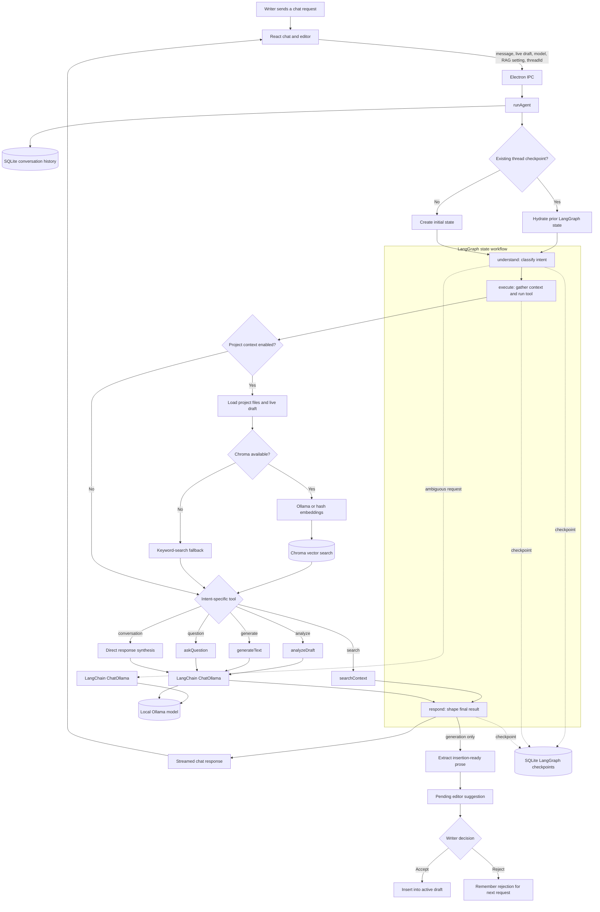

```mermaid
flowchart TD
    U[Writer sends a chat request] --> UI[React chat and editor]
    UI -->|message, live draft, model, RAG setting, threadId| IPC[Electron IPC]
    IPC --> RA[runAgent]

    RA --> DB1[(SQLite conversation history)]
    RA --> CP{Existing thread checkpoint?}
    CP -->|Yes| HY[Hydrate prior LangGraph state]
    CP -->|No| IN[Create initial state]
    HY --> UNDERSTAND
    IN --> UNDERSTAND

    subgraph LG[LangGraph state workflow]
        UNDERSTAND[understand: classify intent]
        UNDERSTAND --> EXECUTE[execute: gather context and run tool]
        RESPOND[respond: shape final result]
    end

    UNDERSTAND -. ambiguous request .-> O1[LangChain ChatOllama]
    O1 --> OL[(Local Ollama model)]

    EXECUTE --> RAG{Project context enabled?}
    RAG -->|Yes| LOAD[Load project files and live draft]
    LOAD --> VS{Chroma available?}
    VS -->|Yes| EMB[Ollama or hash embeddings]
    EMB --> CH[(Chroma vector search)]
    VS -->|No| KW[Keyword-search fallback]
    CH --> TOOL
    KW --> TOOL
    RAG -->|No| TOOL{Intent-specific tool}

    TOOL -->|search| SEARCH[searchContext]
    TOOL -->|analyze| ANALYZE[analyzeDraft]
    TOOL -->|generate| GENERATE[generateText]
    TOOL -->|question| QUESTION[askQuestion]
    TOOL -->|conversation| DIRECT[Direct response synthesis]

    ANALYZE --> O2[LangChain ChatOllama]
    GENERATE --> O2
    QUESTION --> O2
    DIRECT --> O2
    O2 --> OL
    SEARCH --> RESPOND
    O2 --> RESPOND

    RESPOND --> CHAT[Streamed chat response]
    RESPOND -->|generation only| SPLIT[Extract insertion-ready prose]
    SPLIT --> SUGGEST[Pending editor suggestion]
    SUGGEST --> DECIDE{Writer decision}
    DECIDE -->|Accept| INSERT[Insert into active draft]
    DECIDE -->|Reject| MEMORY[Remember rejection for next request]

    UNDERSTAND -. checkpoint .-> DB2[(SQLite LangGraph checkpoints)]
    EXECUTE -. checkpoint .-> DB2
    RESPOND -. checkpoint .-> DB2
    CHAT --> UI
```