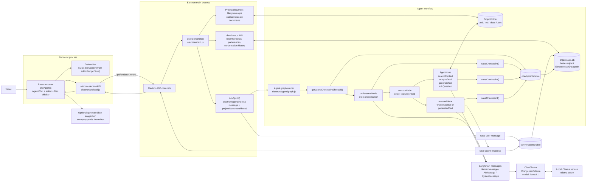
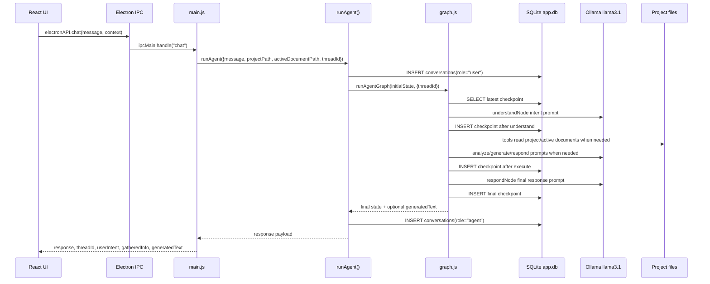
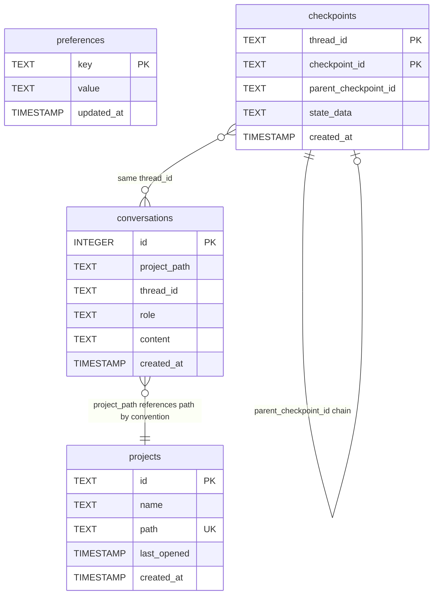

# Drafts Desktop Architecture

## Runtime Interaction Diagram

## Agent Flow

## SQLite Tables

## Key Notes

- UI entry point: `src/App.tsx` builds chat context from the active tab, current project, `threadId`, and live editor text.
- Bridge layer: `electron/preload.js` exposes safe `window.electronAPI` methods; `electron/main.js` owns IPC handlers.
- Live editor content caveat: `src/App.tsx` includes `liveContent` in the chat context, and the agent state/tools are prepared to use it, but the current `electron/main.js` chat handler does not forward `context.liveContent` into `runAgent()`.
- Agent entry point: `electron/agent/index.js` saves the user message, creates initial LangChain `HumanMessage` state, runs the graph, then saves the agent response.
- Agent orchestration: `electron/agent/graph.js` compiles a LangGraph `StateGraph` for `understandNode -> executeNode -> respondNode` and checkpoints after each node.
- LangChain/Ollama: `electron/agent/nodes.js` and `electron/agent/tools.js` use `@langchain/core/messages` and `ChatOllama` from `@langchain/ollama` with the `llama3.1` model.
- LangGraph: `@langchain/langgraph` is installed, and `graph.js` uses a compiled `StateGraph` with annotated state channels for messages, intent, gathered info, generated text, and iteration count.
- Database: `electron/database.js` uses `better-sqlite3`, stores `app.db` in Electron's `app.getPath("userData")`, and enables WAL mode.
- Checkpointer table: `electron/agent/checkpointer.js` creates `checkpoints(thread_id, checkpoint_id, parent_checkpoint_id, state_data, created_at)` with primary key `(thread_id, checkpoint_id)` and index `idx_checkpoints_thread_created`.
